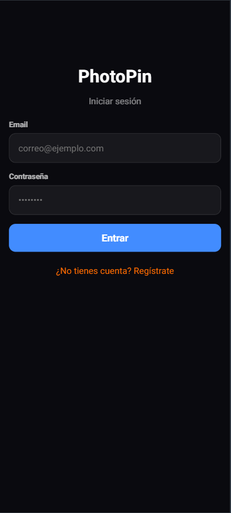
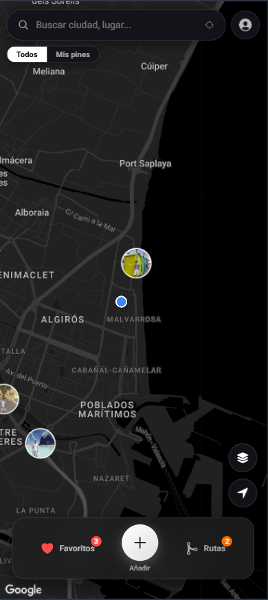

# PhotoPin

> Aplicación móvil full-stack de fotografía geolocalizada enfocada en la exploración turística y descubrimiento visual.

PhotoPin permite capturar, explorar y compartir ubicaciones turísticas a través de fotografías geolocalizadas. La plataforma extrae automáticamente metadatos espaciales (EXIF), agrupa interactivamente puntos de interés en el mapa y ofrece una gestión segura de usuarios y contenido multimedia en la nube.

<p align="center">
  
  &nbsp;&nbsp;&nbsp;
  
</p>

---

## Características Principales

- **Exploración Interactiva:** Integración con la API de Google Maps con clustering dinámico de marcadores para una navegación fluida con alto volumen de puntos.
- **Extracción de Metadatos EXIF:** Detección y procesamiento automático de geolocalización y datos técnicos al subir una imagen.
- **Autenticación y Seguridad:** Registro e inicio de sesión seguros mediante tokens JWT y encriptación de contraseñas con bcryptjs.
- **Gestión Multimedia en Cloud:** Subida y optimización automatizada de imágenes integrada con Cloudinary.
- **Privacidad y RGPD:** Arquitectura diseñada respetando directivas de protección de datos y permisos granulares de ubicación.

---

## Stack Tecnológico

### Frontend y Móvil
- Ionic 8 + Angular
- RxJS (Programación reactiva y manejo de flujos asíncronos)
- Google Maps JavaScript API (Marker Clustering)
- Capacitor / Plugins nativos (Cámara, Geolocalización)

### Backend y APIs
- Node.js + Express.js (Arquitectura RESTful modular)
- JWT (JSON Web Tokens) + bcryptjs (Seguridad y autorización)
- Multer (Gestión de subida de archivos multipart)

### Base de Datos y Almacenamiento
- MongoDB + Mongoose ODM
- Cloudinary SDK (Almacenamiento de assets multimedia en la nube)

---

## Arquitectura del Proyecto

```text
photopin/
├── backend/
│   ├── config/           # Configuración de base de datos y entorno
│   ├── controllers/      # Controladores de peticiones HTTP
│   ├── middleware/       # Verificación de JWT y subida de archivos
│   ├── models/           # Esquemas de Mongoose (User, Photo, Pin)
│   ├── routes/           # Endpoints de la API REST
│   └── server.js         # Archivo principal del servidor
│
└── frontend/
    └── src/
        └── app/
            ├── guards/       # Guardianes de rutas para autenticación
            ├── home/         # Vista principal (Mapa y explorador)
            ├── interceptors/ # Interceptores HTTP (ej. añadir token JWT)
            ├── login/        # Vista de autenticación
            ├── profile/      # Vista de perfil de usuario
            └── services/     # Servicios HTTP y gestión de estado
`
